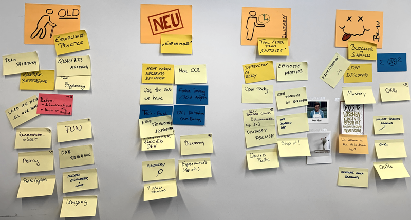

---
authors:
  - wearebasti
date: 2019-07-01
title: Wedding Retro
subtitle: "Or: My Retro Diary Part Two"
thumbnail: ./images/wedding_retro.jpg
teaseralt: Post-it notes from a retrospective meeting
description: Insights on how we do agile retrospectives at Alasco. Following the five steps of agile retrospectives, learn which methods we use and what our key takeaways are.
---

Welcome to the continuation of my "retro-diary" following up on my very first [article](https://alasco-tech.github.io/2019/05/07/retro-diary-one.html). I'd like to share some more insights on how we do agile retrospectives at Alasco. I hope the ideas of my last article were helpful - I'd be very happy to hear about your own experiences!

The retrospective discussed in this article is a themed retrospective. Why themed? As a participant I always was very impressed if the retrospective followed a red thread, a story to keep your thoughts in order.

The theme for this retrospective was: Wedding. "Why" you ask? For two specific reasons my age and Game of Thrones. The age plays a role as I started to get a lot of invitations to weddings lately, very happy for my friends of course! And Game of Thrones? When I was planning this retro the final season fever was going around and the ["red wedding"](https://en.wikipedia.org/wiki/The_Rains_of_Castamere) came up in discussions more than once or twice!

Following the five steps of agile retrospectives I will show how I planned out my "wedding retro". It’s been a bit tough to fit all the games in our 90 minute retrospective, especially with our big team. As a moderator it was very important to plan a bit ahead and keep fixed timeboxes.

### Set the stage

_Get people slowly acclimated with the meeting and in the right mood_

Activity: [Amazon Review](https://retromat.org/en/?id=18)

Look back on the last iteration and rate it on a 5-star scale. One rating per person and iteration, some explanation around the rating of everyone. Goal: Keep it short, make people remember the last sprint.

It connects to the wedding theme by imagining that the last sprint was the process of ordering the wedding gift via amazon. How would you rate your experience and why?

### Gather data

_Help everyone to remember the last spring and collect a shared pool of information_

Activity: [Retro Wedding](https://retromat.org/en/?id=89)

The name already gives that it fits the theme. The [old bridal rhyme](https://en.wikipedia.org/wiki/Something_old) that I - as a German - only know from tv-shows and movies frame important learnings and proposals from the team:

_Something Old_ → Feedback on an established practice

_Something New_ → Feedback on experiments in progress

_Something Borrowed_ → Idea from another team, the web or yourself for a potential experiment

_Something Blue_ → Any blocker or source of sadness

In my opinion, especially the mapping from the rhyme to actual work process related items leads to think out of the box more than by just having the four questions to answer.

### Generate insight

_Why did (the gathered) things happen the way they did?_

Activity: [Learning Matrix](https://retromat.org/en/?id=9)

After the team had time to discuss the items from the last step we move forward. Given the wedding is over - as is the sprint - how would you rate the items that popped up? A four quadrant matrix is given:

| **Keep :-)**   | **Idea**         |
| -------------- | ---------------- |
| **Change :-(** | **Appreciation** |

&nbsp;

Everyone got time to sort their ideas fostered by the last activity in these quadrants.

### Decide what to do

_Pick issues to work on with concrete actions_

Activity: [Keep, Drop, Add](https://retromat.org/en/?id=38)
After having discussed what you liked at the wedding and what ideas you got it’s time to find actions for your own! Everyone writes down behaviours to keep, drop and add to the next sprint - or your wedding so you will ;)
The key is to have concrete proposals on what to do!
When everyone had time to propose their ideas to the rest of the team a [dot vote](https://en.wikipedia.org/wiki/Dot-voting) is held to find the “real” action items. Given your sprint length and velocity you might want to decide on one to three action items to work on.

### Close the retrospective

Goal: _Bring attendees back to “reality”_
Activity: [Note to self](https://retromat.org/en/?id=104)

Ever had the feeling of “I will never do XYZ again” after a wedding celebration? This game is for you!

Everybody reflects about their experiences on the iteration and what was discussed in this retrospective. The goal is to have an action item for yourself: What have I seen in my own behaviour that I’d like to do more (or less) of?

Write the idea down and keep it for yourself - no need to share this time.

## Key Takeaways

I really wanted to do a themed retro but in hindsight this was not really necessary. In my opinion it’s way more important to have a clear line of activities that play together nicely than having a cool setup around them. Though, it can help to relax the participants a little. Should you use a themed retro? In my experience a well working team is usually fine with sharing in the group. If the team is new or you want an additional “trigger” a theme might help bringing an additional angle into the games.

### Really understand the activities

The learning matrix activity almost killed this retrospective. Due to not taking enough time for it I missed some obvious questions that might come up - I managed to work around it but that was definitely something to do better next time.

### Always Say Goodbye

When I read about the games to close the retrospective, they often sound forced to me and are meant to be done very fast. So, here and then I am not sure if it’s worth the trouble - especially when you’re running out of time anyways. In my experience the feeling of people leaving is way more at peace by following up on a closing activity. Do not underestimate how much energy it took everyone to take part in the retrospective. I think it’s a way of showing appreciation for everyone's efforts.

### Write Down Activity Items

Make sure to actually write down the activity items everybody agreed on doing. Those notes can be kept in a public place so all team members get a slight reminder here and then. A second benefit is that it’s way easier to follow up in the next retro on those items!

Hopefully this brought some inspiration to other people out there fighting to continuously improve their processes and teams!
