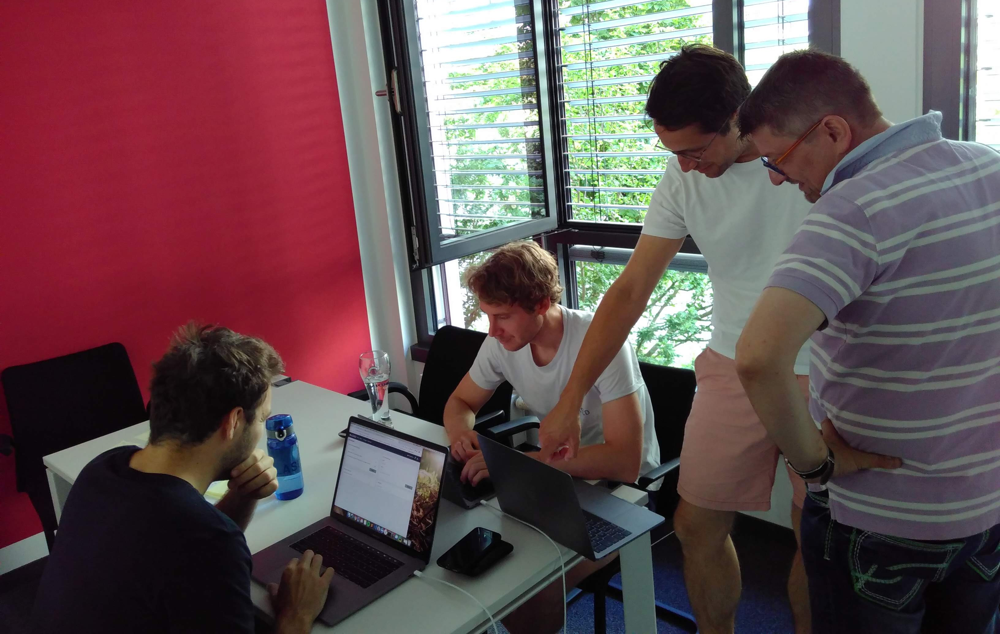

---
authors:
  - moser
date: 2019-07-02
title: "ShipIt day: Recap"
thumbnail: ./images/shipit_day.jpg
teaseralt: Alasco ShipIt day banner
description: Recap of the Alasco ShipIt Day 2019. Check out what our product team came up with in an axciting and fun 24h hackathon.
---

In our day-to-day work focussed on digitizing the cost controlling in
construction projects, we sometimes lack the time to freely experiment on
unlikely ideas to solve our customers’ problems and to collaborate with all
other roles & teams in our company. From time to time, you have to step out of
routine and work on something different collaborating with people you are not
usually working with.

The company behind Bitbucket, Jira & Confluence - Atlassian - has a tradition
to run so called ShipIt Days. The basic idea is to organize a 24 hour
hackathon. Participants choose the problems they want to solve and form teams
with other interested people. The goal is to have something “shippable” in the
end. Some of us had already taken part in these in other companies. To allow
for more free experimentation & collaboration, we decided to run a ShipIt day
within the product team.

Two weeks before the event we asked the whole team to keep their eyes open for
problems that would make good projects for the ShipIt day. The ideas were
tracked in a Google Doc, with a headline and a 4-6 sentence description. Our
sales team was very committed and did a dedicated brainstorming session to come
up with ideas. We limited the scope of projects to “customer problems”, because
a side-goal was to learn more about our customers and their problems. Limiting
to problems and not solutions reduces biases towards certain solutions and
gives more room for experimentation. In total we gathered 51 ideas for possible
projects.

Thus, our biggest problem was to form teams interested in working on the same
idea ;-) We asked the participants to go through the project ideas before the
kick-off meeting and to note the three ideas that are most interesting to them.
In the meeting we grouped people by their favorite ideas and asked them to form
teams. Next time we would take some time to thin out the list of ideas by
removing (or rather merging) duplicate ideas and ask people to mark their
favorite ideas in a spreadsheet before the meeting, because asking everyone for
their favorites and writing their answers down on the whiteboard took quite
some time.

With 5 teams formed we started into the 24 hours at 3 PM on Tuesday. At 7 PM
the traditional ShipIt day food - Pizza - was served. Already within the first
hours teams made huge progress. Before dinner, our UX researchers already had
finished two little tests with real users to check if solutions made sense.
Most people stayed in the office until around 11 PM. On the second day,
participants returned in the morning and continued their work. At 3 PM the
whole company gathered in the meeting room and the teams presented their
projects (in less than 10 minutes per team). After the presentations, we asked
the audience to vote for the project that in the opinion offered most value to
our users. We just used pen & paper to vote, but for bigger audiences offering
a quick form poll would make sense. Our poll results were pretty close, with
just one vote between the winner and the runner-up.

The winning team - Anselm, Tom & Jan - built a prototype that visualizes the
configuration of workflows in our product and allows the user to edit them,
helping both our customers to understand the process setup and our customer
success team to configure the process with them. The product owners have
already signaled that they will put the implementation in the backlog. As a
little prize for the winners, we will send them to an “Exit the room” game and
\- we are a Munich based company after all \- to the beer garden afterwards.

Interested in taking part in our next ShipIt day? We’re looking for great team
members, check out our open positions at
[https://www.alasco.de/en/](https://www.alasco.de/en/).
