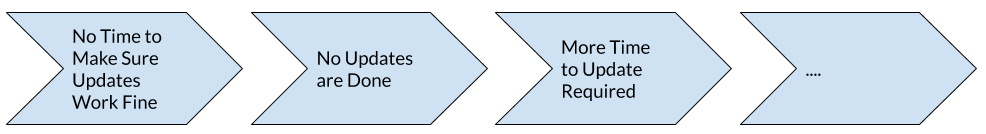
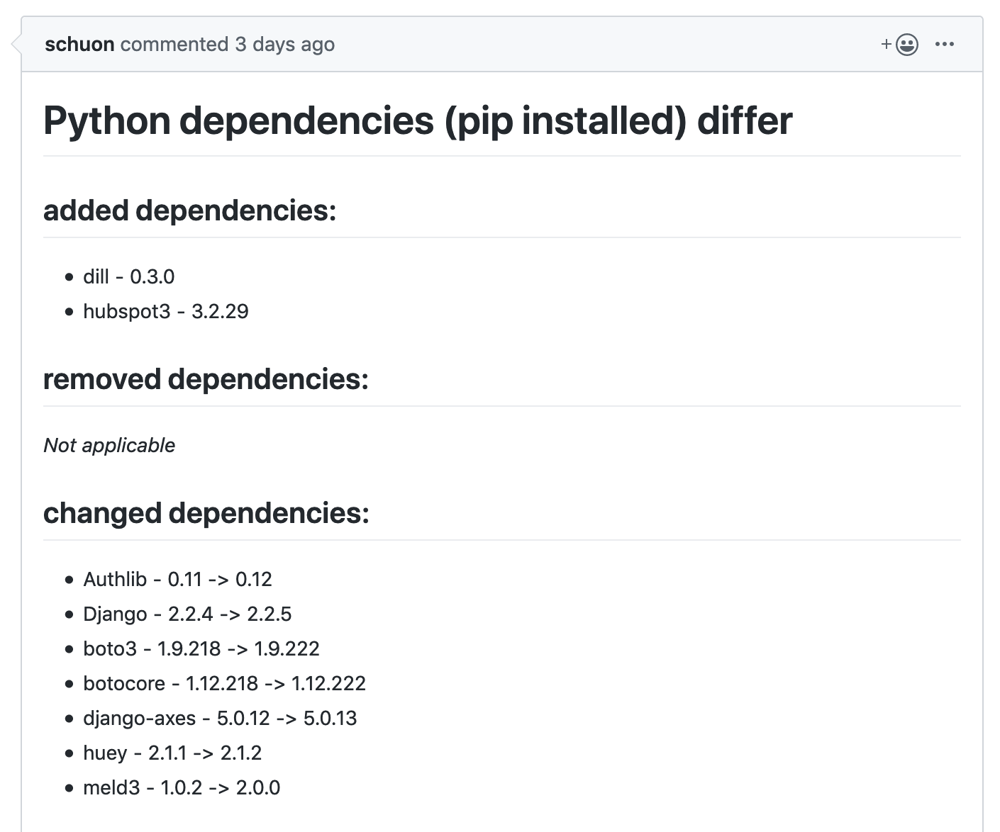

---
authors:
  - wearebasti
date: 2019-09-24
title: Dependency Hell? Automate it Away!
subtitle: A way out of shaky deploys and unfixed security holes.
thumbnail: ./images/dependency_hell.jpg
teaseralt: Hand holding a compass
description: Learn more about Alasco's build process and how we automated updating our dependencies in our base docker images.
---

For a couple of years I've been working in DevOps environments now. This enabled me to learn about various technologies:

- Docker
- Orchestration (Amazon ECS and a tiny bit of Kubernetes)
- CI/CD (from Jenkins to CircleCI)
- Databases (MySQL, PostgreSQL, Redis, DynamoDB...)
- Infrastructure as Code
- Serverless (AWS Lambda)
- ...and many more!

I also faced the more challenging side of operations like: monitoring, deploy time, dependency management and compatibility issues. Still all the mentioned topics can be tremendous fun!
In my experience one of the biggest challenges is to fit "operations" work in a normal sprint cycle. It's often misinterpreted as technical debt.

### Never Change a Running System?

This reasoning can lead to a lot of problems, for example too long postponed library updates
which would solve security problems. Just have a look at the list of known
vulnerabilities in [Django](https://www.cvedetails.com/vulnerability-list/vendor_id-10199/product_id-18211/Djangoproject-Django.html) that are no risk for you if you can stay up to date. The same is true for docker images where 20% of risks would be solved by simply rebuilding them or using another base-image! (source: [snyk](https://snyk.io/blog/top-ten-most-popular-docker-images-each-contain-at-least-30-vulnerabilities/))

### Newer is Always Better

Do not underestimate the fact that newer systems can bring cool new features for developers. These can save a lot of trouble or simply bring some joy in the development process. One example is the introduction of `RedisExpireHuey` in version 2.0.1 of [huey](https://github.com/coleifer/huey) where you got automatic clean up of task results "for free"! Alternatively you'd have been stuck with implementing something similar yourself.

### The Value Culprit

Sprint planning focuses on delivering the most value to the user - and right so! All the same this causes postponing maintenance of software & systems as it's not seen as a priority.

After weeks, months or even years of neglecting upgrades you're stuck with a system you have to change but can't anymore! What does this mean?

- You might be stuck with open vulnerabilities
- You can't use new features
- You can't introduce new tools / systems as they do not support the old ones anymore (e.g. python2 to python3)

All this would be avoidable by upgrading early and often. A lot of teams struggle with little confidence in the safety of upgrades. This becomes a vicious circle:



One possible solution would be to follow the advice [Robert C. Martin (Uncle Bob)](http://cleancoder.com) on twitter on the topic of refactoring:

<blockquote class="twitter-tweet blockquote text-right" data-lang="en"><p lang="en" dir="ltr" class="mb-0">The word “refactoring” should never appear in a schedule. Refactoring is not a story or a backlog item. Refactoring is not a scheduled task. Refactoring is immediate and continuous. It’s like washing your hands in the bathroom. You always do it.</p>
    <footer class="blockquote-footer">Uncle Bob Martin (@unclebobmartin) <a href="https://twitter.com/unclebobmartin/status/1024254121338126336?ref_src=twsrc%5Etfw">July 31, 2018</a></footer>
</blockquote>
<script async src="https://platform.twitter.com/widgets.js" charset="utf-8"></script>

While trying to follow this good advice by Uncle Bob I am still facing the
issue of maintenance taking a long time. So one issue to solve is that upgrading should be idiot-proof, aka.: safe for me to use!

### Automatic == Safe

We are using base docker images to support our deploy process outlined a bit in
the [blog post](/2019/02/14/engineer-to-pm/) by Sebastian Schuon.

One thing that always bothered me was on how and when (!) to update dependencies in our base docker images. One thing that comes to mind: Automate it! But how? An automatic upgrade process would have to be a no-brainer, working smooth without (human) intervention and not be breaking things.

The whole process is managed by a scheduled CircleCI job that runs every Wednesday night. This job does all things necessary to check for changed dependencies.

The build process is pretty much standard:

1. Checkout our application code
2. Build our base image from "scratch"
3. Pull our existing base image from the repository
4. Use googles' [container-diff](https://github.com/GoogleContainerTools/container-diff) to compare the images

### Compare Docker Containers

As just mentioned `container-diff` is helping a lot in comparing the docker build results. After installing it (described well in the readme) it's actually as easy as calling it with the two images you'd like to compare.

The following call gives you a diff in a JSON format, which is quite enough to
check for differences:

```bash
container-diff diff daemon://alasco-app-base:newimage remote://current-base-image --type=pip -j > diff.json
```

There are different differs pre-installed with `container-diff` and can be given via the `type` parameter. The specialized ones, like `pip` in this case, are great in seeing differences for special deployments like our python app. There are many more, e.g. one for `apt` - the package manager of debian based linux distributions.

### Changes Detected: What Now?

So the image is rebuilt, compared to the existing base and there's a difference in installed package versions detected.

The new base image is then pushed to the repository, and set as the new reference in our application dockerfile.

It'd be easy now to just accept these changes, but this would mean risking problems because of breaking changes brought in by some of the updates.
Following the safe route the changed dockerfile is pushed on a new branch and a pull-request is created for it. As Sebastian Schuon wrote in his post our branches get automatically deployed to live instances so it's easy to assess the safety of the updates: The full test suite is run and you actually can click through a running deploy of our app!

### Beautifying the Diff

The `container-diff` JSON output can be cumbersome to read. As one of the goals was to make the pull request easy to read some more work was necessary. I wrote a little helper script to pull out the necessary data and print it out in markdown.

Admittedly it's not bullet proof or especially nice but it gets the job done:

```python
#!/usr/bin/env python3

from typing import Dict, List, Tuple

import argparse
import json

def _read_pip(diff: dict) -> dict:
    result = {"added": [], "removed": [], "changed": []}
    mapping = (("Packages1", "added"), ("Packages2", "removed"))

    for json_key, result_key in mapping:
        for package in diff.get(json_key, []):
            result[result_key].append(
                (package.get("Name", "n/a"), package.get("Version", "n/a"))
            )

    for package in diff.get("InfoDiff", []):
        old = package.get("Info1", [{}])[0].get("Version", "n/a")
        new = package.get("Info2", [{}])[0].get("Version", "n/a")
        result["changed"].append((package.get("Package", "n/a"), f"{new} -> {old}"))

    return result

def _read_json_file(in_file: str) -> List[Dict]:
    with open(in_file) as src:
        input_ = json.load(src)

    pip_result = {}
    for diff in input_:
        type_ = diff.get("DiffType")
        if type and type_ == "Pip":
            cur_diff = diff.get("Diff", {})
            pip_result = _read_pip(cur_diff)

    return pip_result

def _print_result(pip_diff: dict, file_diff: dict):
    if pip_diff and any(pip_diff.values()):
        print("# Python dependencies (pip installed) differ")
        for key, elements in pip_diff.items():
            print(f"## {key} dependencies:")
            if elements:
                print("\n".join(f"- {el[0]} - {el[1]}" for el in elements))
            else:
                print("_Not applicable_")
            print("\n")
    else:
        print("# No Python dependencies changed")

def main():
    parser = argparse.ArgumentParser(description="Beautyif container diff output")
    parser.add_argument(
        "input_file", type=str, help="Path to diff file to read (json format)"
    )
    args = parser.parse_args()
    in_file = args.input_file

    pip_diff = _read_json_file(in_file)
    _print_result(pip_diff, file_diff)

if __name__ == "__main__":
    main()
```

### Experience so Far

Through this setup we merged by now 39 pull requests and counting! It helps tremendously to stay up to date with our dependencies and everyone in the team can make sure the update is safe by just following the normal build procedures.


