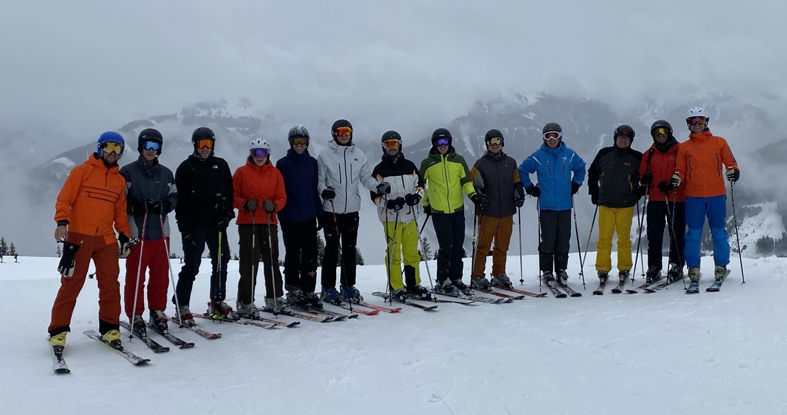
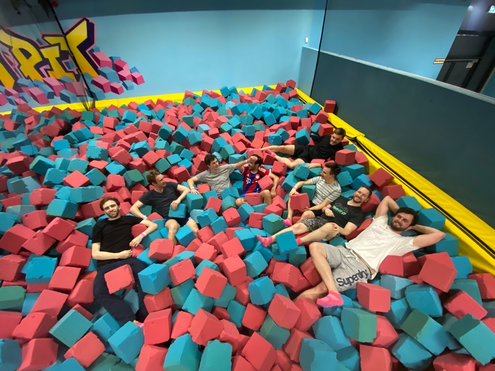
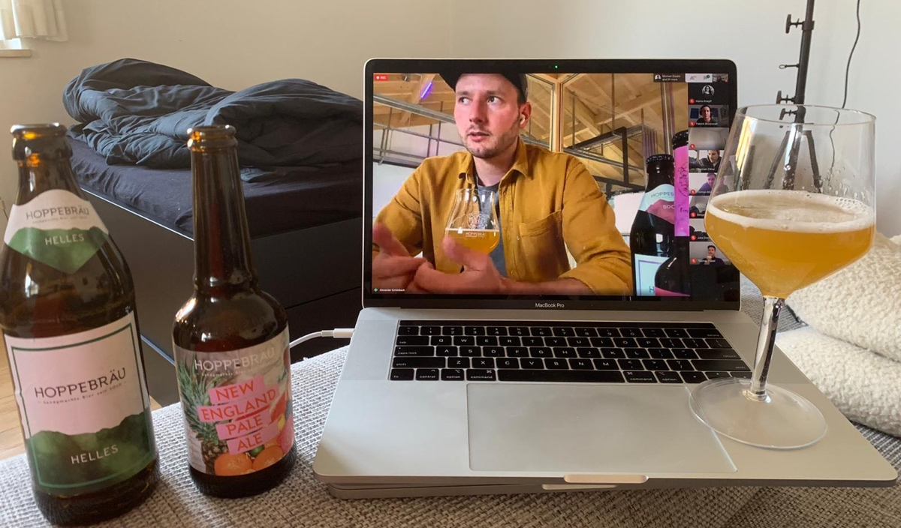

---
authors:
  - wearebasti
date: 2020-05-29
title: Meet Your (New) Colleagues
subtitle: Team events at Alasco
thumbnail: ./images/your_new_team.jpg
teaseralt: Team members putting their hands together
description: Culture & Teamwork at Alasco; How we build trust, ambition, positivity and appreciation through team events and social gatherings.
---

At Alasco we work every day to reduce costs and duration of construction projects. Following this clear vision and goal of bringing value to our customers, there are two major topics that define our work: Culture (the values we live and work by) and teamwork.

### Culture & Teamwork at Alasco:

Our work and all the things we do are based on our four company values:

- Ambition
- Appreciation
- Positivity
- Trust

These values are not only mere words for us, they are a guiding star for our processes, communication and work life.

Besides our culture, teamwork is a very important topic for us.

> Individual commitment to a group effort – that is what makes a team work, a company work, a society work, a civilization work.

-- Vince Lombardi

In a fast growing team such as ours it can be challenging to keep our values in sync, to constantly support the growth of the team and to make it easy for new members to really feel like a part of the team.

For these reasons we organize many team events every year.

Alasco does an all-team event each month. Everyone from each department is invited! It fosters connections between different teams. Additionally the product and engineering department has an additional event once per quarter (because of COVID-19 we bumped that up to once a month!).

Following, I’d like to show an example of each of these events: company wide, team internal and remote team events!

Two learnings from our team event organization:
Doodle is your friend for finding a date where most people have time. After you fixed a date, it’s as easy as a Slack poll to define what you actually want to!

### Company Wide

On of the highlights is our yearly [Alasco ski-trip](https://www.linkedin.com/posts/alasco-software_teamalasco-skitrip-alascoonsnow-activity-6642799752998080513-l8uL) - A great way to grow and stay together. Lots of fun is guaranteed! If you can’t or don’t want to ski there’s of course always an alternative program provided for you - this year we did a hike with Alpacas!

The bus tour itself is a great team event already to get to know each other better, spending a weekend together in the alps: just fabulous!

### Product & Engineering Team Internal

As mentioned above, we also do activities within the individual teams, in addition to our company wide team events. The latest product team event was a visit to a local trampoline park in Munich. About two hours of jumping, playing dodge ball and laughing with each other helped us a lot to tighten bonds.

After the exhausting activity we let the evening come to an end by having dinner together at an artisan burger joint and sharing some drinks!

### Remote

Given the state-wise recommended lockdown the Alasco team went full-remote. To keep up the spirits in these times, our lovely colleagues [Hanna](https://www.linkedin.com/in/hannakoepff/) and [Thomas](https://www.linkedin.com/in/tplatiel/) organized a remote beer tasting!

The nice people at [Hoppebräu](https://www.hoppebraeu.de/en) agreed to give us an introduction into the art of brewing beer, including the brewing process and recognizing the taste notes of different beers. We learned a lot from the infamous “Hell” to the exotic “New England Pale Ale”: A rather important skill set for our Munich-based team!

Personally, I think team events are essential to a work environment. Getting to know your colleagues in a setting outside the workplace strengthens your bonds and ultimately helps you understand them at work.
