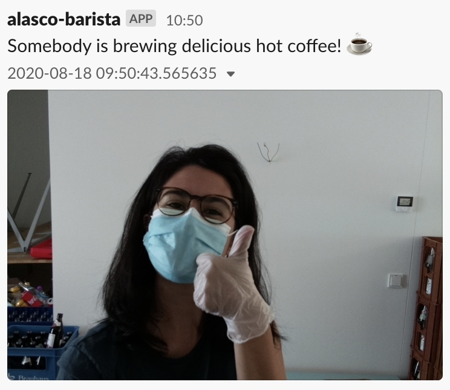

---
authors:
  - chrisittner
  - wearebasti
date: 2020-08-23
title: Coffeegram - One Coffee & a Picture Please
subtitle: The story of our picture taking coffee machine
thumbnail: ./images/coffee-lovers.jpeg
teaseralt: Three cups of different coffees - Photo by Nathan Dumlao (https://unsplash.com/@nate_dumlao)
description: During our latest ShipIt Day we built a Raspberry Pi based bot that takes pictures of people making coffee and posts it on our companies Slack.
---

The past months have been challenging to everyone. The pandemic has changed lives, the way we meet people and of course also the office set up and Alasco has been no exemption to that. At Alasco we are quite some coffee lovers, but after returning to the office in May, we had to find a solution to keep using our beloved coffee machine whilst making sure to have all employees safe.

For the fellow coffee geeks, our coffee setup consists out of:

- [ECM Synchronika](https://www.ecm.de/en/products/details/product/Product/Details/synchronika/)
- [Mahlkönig E65s](https://www.mahlkoenig.de/products/e65s)

## Coffee in Pandemic Times

As around March the Corona/Covid-19 pandemic hit Germany hard we followed official recommendations of our government and started to work fully remote for some time. This meant no access to our coffee machine, which for some of us meant an absolute downgrade!

For a couple of weeks now we are allowed back in the office, following some strict safety regulations our management team has set up! One of the key tasks was to make sure that the coffee machine wouldn’t become a superspreader location. Our rule: Wear a mask and gloves!

Having more than 40 employees, this rule would soon result in an enormous amount of waste. To make this easier and reduce plastic waste (aka: used gloves), everyone making coffee is supposed to be making a bunch of coffee for everyone in need of a delicious hot cup and inform everyone via slack. **Plot twist:** Our office consists of two floors, so it was very easy to forget people not being visible.

As we try hard to be inclusive, this was not ok for us! During our ShipIt Day in August, my colleague Basti and I decided to address this problem and come up with a solution that keeps everyone safe while making sure that a regular coffee supply is secured.

## Quick info: What is a ShipIt Day?

Strongly influenced by the idea from [Atlassian](https://www.atlassian.com/company/shipit), we do a ShipIt Day once a quarter. The basic idea is to get 24 hours to work on something outside of your daily routine.

As mentioned above, Basti and I had the opportunity to fix the coffee issue by automatically posting a slack message when someone makes a coffee. So everybody is automatically informed and can ask for a cup!

If you’d like to learn more about our ShipIt Days: Our dear friend [Martin](www.moserei.de) wrote an article about why and how we manage [ShipIt Days at Alasco](https://alasco.tech/2019/07/02/shipit-day-recap.html).

## Solution

The coffee grinder now automatically triggers a slack message when coffee is about to be prepared. If you use the machine, wear a face mask & gloves, and stick around for a moment and serve espresso (via a table to not touch each other) — for everyone showing up.

## Technical Solution

Our solution is publicly available on our [GitHub Repo](https://github.com/alasco-tech/shipit-coffee-machine). It’s been created in less than 24 hours, so please expect some hackiness!

### Hardware

We use a [Voltcraft SEM6000](https://www.conrad.de/de/p/voltcraft-sem6000-energiekosten-messgeraet-bluetooth-schnittstelle-datenexport-datenloggerfunktion-trms-stromtarif-e-1558906.html) smart power plug to monitor the real-time power consumption of the coffee grinder.
Detecting machine use via power consumption has the advantage of not interfering with the cleaning and maintenance of the coffee machine. The Voltcraft SEM6000 is an easy to use device for scripting, because somebody made [a very nice command line tool](https://github.com/Heckie75/voltcraft-sem-6000) to control it from a Linux machine.
A [Raspberry Pi](https://www.raspberrypi.org/) monitors the real-time wattage of the coffee grinder reported by the smart plug to observe when the machine is turned on. When detecting usage, a picture is taken via the [Pi Camera Module](https://www.raspberrypi.org/products/camera-module-v2/) and posted to slack, along with a message. Additionally, we count the number of espresso made and report it to [Datadog](www.datadog.com).

### Software

Starting from a vanilla [Raspberry Pi OS Lite](https://www.raspberrypi.org/downloads/raspberry-pi-os/) installation, we set up SSH and wifi credentials for [headless usage](https://desertbot.io/blog/headless-raspberry-pi-3-bplus-ssh-wifi-setup).
We used a systemd-service to make sure the coffee bot would stay available 24/7.

This project would not have been possible without the great libraries by:

- [Heckie75](https://github.com/Heckie75)
- Slackbot
- Datadog

And many more!
