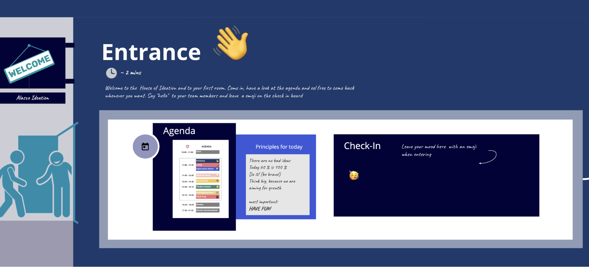
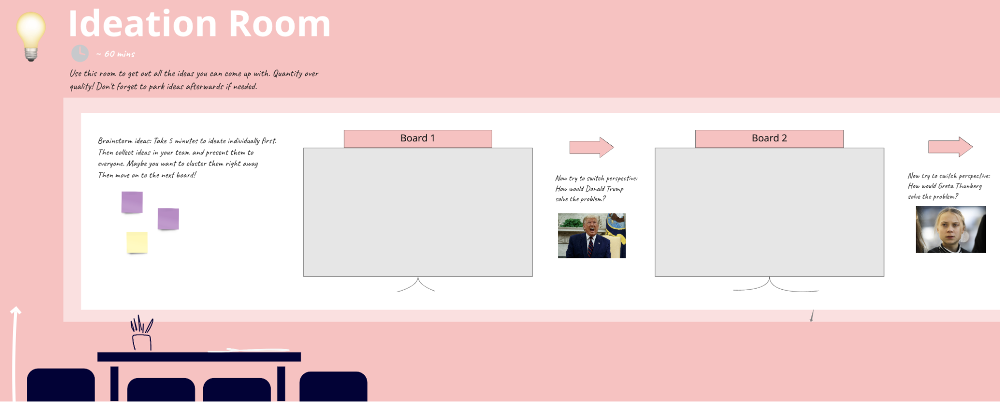
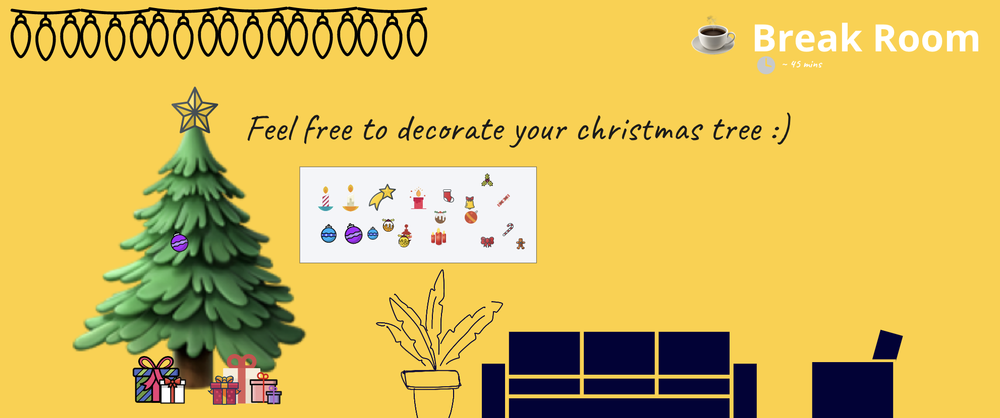
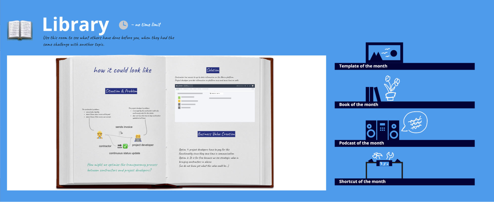

---
authors:
  - juliabastian
date: 2021-01-08
title: Designing a Remote (Ideation) Workshop with Miro
subtitle: I aced a remote Ideation Workshop with Miro - here is how and what I have learned.
thumbnail: ./images/ideation_day_image7.png
teaseralt: A full overview of activities in Miro
description: I aced a remote Ideation Workshop with Miro - here is how and what I have learned. I knew that I did not want the remote workshop to be a poor version of an on site one. Therefore, I designed the workshop in a way that uses the remote setting as an advantage - and Miro is a great tool for that.
---

I aced a remote Ideation Workshop with Miro - here is how and what I have learned.

I knew that I did not want the remote workshop to be a poor version of an on site one. Therefore, I designed the workshop in a way that uses the remote setting as an advantage - and Miro is a great tool for that.

    

        <small>
    
        
            <em>Key Data about the workshop:</em>
            <ul>
                <li>One-day remote Ideation Workshop at a Proptech</li>
                <li>Initiated by the product team & founders</li>
                <li>35 participants  six teams & six different challenges</li>
                <li>Tools: <a href="https://miro.com/">Miro</a> and <a href="https://zoom.us/">Zoom</a></li>
            </ul>
    

    

    

        <em>Goals of the workshop:</em>
        <ul>
            <li>Get ideas & inspiration for  future product initiatives</li>
            <li>Think outside the box by including  everyone in the company</li>
            <li>Get everyone in contact with the product</li>
            <li>Connect cross department-wise</li>
            <li>Have fun</li>
        </ul>
    

    </small>
    

Besides the main goal of a workshop (e.g. creating ideas, education), it should be fun and inspiring for the participants and getting them out of their daily routine. In a non-remote setting this is rather easy, using posters, various cards, pens stickers etc, but in the current situation, these items need to be transferred to an online, easy to use setting. Miro gave me the perfect opportunity to do so, with its many possibilities, one can overcome the drawbacks of working remotely.

For the Ideation Workshop I decided to create a “House of Ideation” where each team moves through independently - as we are a proptech company, a house seemed quite suitable to me (other ideas: traveling from one island to the next or driving a car to different places). You can be really creative but you should think of a theme that connects the process and the setting in a way that makes sense and does not take away too much attention from the main task.

## Taking a tour through the house of ideation.

Welcome to the Alasco house of ideation and a couple of it´s rooms!

First of all I think it is essential to create a structure in every room that helps the participants to get orientation.Therefore, I have given each room a name and an emoji which can be found in the agenda as well, and I have added a time and a description.

### The Entrance

The Entrance is the first room to meet up with the team. It gives some general information and invites the participants to become active through the check-in board.

### Ideation Room

In the Ideation room the teams have different boards to become creative. The easiest thing to work with in Miro are probably the post-its. Therefore, it is ideal to do brainstorming sessions. Compared to an on site workshop you do not have the problem of bad handwriting and the clustering of post-its is way faster. Furthermore, I love that you as a facilitator do not have the effort of digitizing post-its afterwards (I think every workshop facilitator knows this struggle).

### Break Room

Since the workshop was shortly before christmas, I have added a little game in the break room. Every team was able to decorate their christmas tree and at the end of the day we even nominated the prettiest. It is just fun for the participants (and the facilitator) to add little games like this.

### Library Room

In a remote setting it is really difficult for a facilitator to see if all teams are on track and have understood the task, since you can not simply walk around. Furthermore, the psychological barrier for participants to ask the facilitator for help, when they are stuck, is higher. This can lead to a huge waste of time for the teams. Therefore, it is important to be as precise as possible. I have added the room “Library” which gives an example of how the pitch in the end could look like. I also added an example of how a prototype of an interface could look like to take away the fear of trying this out. Nevertheless I found it to be extremely helpful to talk to the teams from time to time to make sure they are on track and understood everything.

Our workshop day ended with a pitch of the results. The pitch was also prepared by the teams on the Miro board.

## My Learnings from the remote workshop with Miro

Even though I have done many on site workshops, it was my first workshop with Miro and I wanted to share some of my learnings that might help others for their first try!

- I really liked that I as a facilitator was always able to jump into the different team´s Miro boards and see their progress
- Many people worked with Miro in the Workshop for their first time. However, they all felt really comfortable to use it since Miro is really intuitive
- You have to make a decision beforehand whether you want all teams to work on one board (if you have many participants this might influence the loading time of Miro) or on multiple boards. I have decided to create one Master Board and then copy it for each team, since it was more important for me to have a good performance of Miro than to have the teams see each other's progress.
- After the preparation you have to lock all items and especially backgrounds on the Miro Board otherwise the participants can move every little element.
- Miro has many great add-ins. I especially liked the wireframe library since it is a very fast way to prototype first solutions.
- If you facilitate a workshop with many participants and boards it makes sense to have a paid plan. I decided to take the “consultant plan” which was great because you can invite an unlimited number of people and you do not have to pay for each one.
- In addition to Miro we worked with Zoom and its breakout rooms which is a great way to timebox, give instructions or do some warm up exercises

## How have your experiences with Miro been so far? Any learnings you have made and that you want to share?
