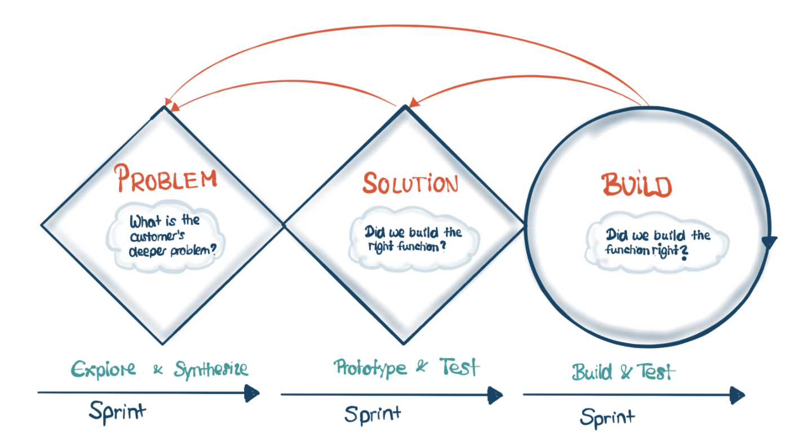
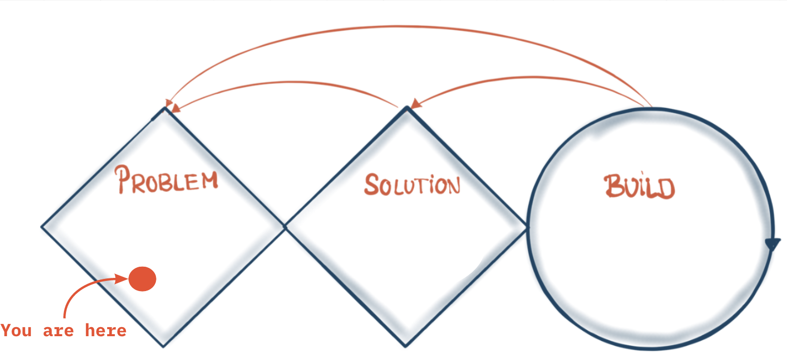
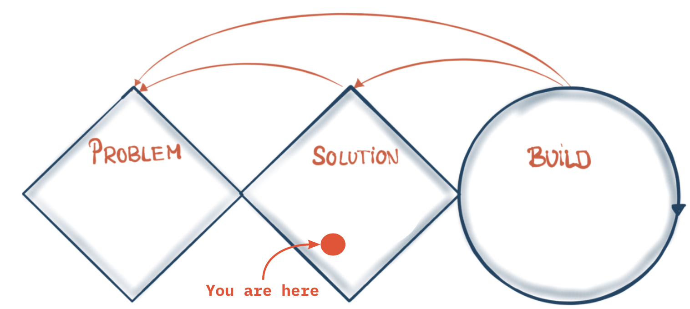

---
authors:
  - anika-watzka
date: 2021-03-29
thumbnail: ./images/it_is_about_the_user_teaser.jpg
title: It’s not about us, it’s about the user
subtitle: UX-Research at Alasco
teaseralt: Woman in blue long sleeve shirt and blue denim jeans sitting on bed using laptop
description: You may be asking "What is UX?" It stands for User Experience, or in other words, "How does the user interact with the product?".
---

Hi, 👋

I’m Anika and I just finished my internship as a UX-Researcher in the Product Team at Alasco.
_Spoiler alert:_ I enjoyed working at Alasco so much that I’m now continuing as a working student.

### You may be asking: _"What is UX?"_

It stands for User Experience, or in other words, “How does the user interact with the product?”.

UX-Research at Alasco is about being at the intersection of the customer and the product. Its goal is to explore user needs and pain points to then talk to a designer and product managers in order to make better user-centric decisions and, at the end of the day, build products that solve our customer’s problems.

The theory of UX is often described by this double-diamond shaped visual:

The process starts from exploring and understanding the pain points of the customer through quantitative and qualitative research. The first phase is followed by ideating and testing a potential solution that solves the user’s problem in the easiest way possible. Finally, in a last step you are building the product or feature.

# Episode 1: Finding the Pain Point

## 🕵 Being the detective

In this step the goal is to explore and synthesize the pain points of the customer.
This can go in multiple ways depending on the kind of project we are working on. If we are seeking to improve or further develop an already existing feature, we start with the quantitative and work ourselves through to the qualitative.
Though, if we are planning on building a new feature from scratch, qualitative feedback is our way to tackle it. Generally speaking: The quantitative helps us to find where to look at and the qualitative helps us to understand the why.

## 🤓 Let’s look at the numbers first:

Interpreting the quantitative data and inductively deriving hypotheses from it, lays the foundation of the qualitative research.
My personal tool-box is called Pendo and Metabase which enable us to interpret aggregated usage data:

- User journeys (the paths the user takes to walk through the software) which reveal behavioral patterns of our customers in Alasco  
  _For instance:_ What is the users’ process to upload a new invoice in Alasco?
- The click behavior, which is especially insightful to interpret the usage of current features and pages  
  _For instance:_ What item of the navigation bar do users click the most frequently on?
- And raw data  
  _For instance:_ The number of users that are working in the accounting department and are using a specific feature.The exact number of users using a certain feature in a specific project

During this process we are asking ourselves questions like:

- Are there any steps we are directing the user to that they did not anticipate or expect?
- How could we simplify the feature in order to make the software more user-friendly?
- For which specific use cases do the users apply the feature to?

Having done this quantitative desk research is a good start, right?

In the best case scenario it enables us to make semi-educated hypotheses about the customers’ pain points.However we still cannot be entirely certain about what the user actually wants and needs.
To say it shortly: Quantitative data only sheds light on what potentially could be a pain for the user. 🔦
Which is why customer interviews are vital.

Initially, customer feedback is channeled through customer success and sales people as they are the direct contact of our customers. This feedback gives us a good idea of what the user’s pain points are and thus often lays the groundwork for the upcoming user interviews that we conduct.

The questions posed from the sales and customer success department are “What is the users’ feedback?” and “Why does he need what he is asking for?” In the UX-Research we are going to dig deeper into the specific topic. However in the first step, discovery interviews with customers is our way to better understand the scope of the topic.

Having now identified the users’ paint points it’s finally time to
🥁🥁🥁🥁🥁🥁

## 💡 Ideate

Disclaimer: This part includes a lot of sticky notes! To be completely honest with you, the sticky notes are not as sticky at the moment due to the remote setting, that’s why we switched to a tool called Miro.
In order to unite all of the important perspectives on the feature, we ideate with a mix of front-end and back-end software engineers, product managers and designers. As project finances in the construction industry are so complex, it is crucial to think about all the interdependencies of features within the software.
The goal of these sessions is to come up with possible solutions for the previously identified users’ problem. As we are currently working remotely, Miro has proved to be a great tool to quickly sketch and discuss ideas.
Once the ideas have been reduced to the best ones, it is then time to..

# Episode 2: Solving the problem

## 🧩 Prototype

As it is way easier to get feedback on something that can be experienced by the user, we are transforming our ideas into prototypes.
My personal toolbox is called Miro and Figma, which we use for the creation of visual mock-ups and clickable prototypes.
One of my takeaways in this step is to focus on the important parts of the potential feature first. All of the fancy add-ons can wait for now, since those would distract the user and be unnecessarily time consuming.

"Insert a smooth transition to the next paragraph"

## 👂 Let’s test and listen!

Testing the prototypes with the customer sounded a little scary at first, yet it is the most interesting part of the process as you learn something each time. Customers definitely surprise us!
The feedback to the same feature can vary as much as _"I could have done this calculation by hand"_ to _"This is so cool, I definitely want to use that for my new project in Alasco"_.

A huge plus: Customer interviews are the closest we get to the real world before actually building the feature which makes it feel even more exciting and important.

After letting the customer know that we care about their honest feedback and that we tested the product, not them (in case of prototype testing). We start the conversation with an open-ended question that stimulates the user to start telling his "story". Here are some of the things I learned:

- You want the user to tell their "story". To enable that, very few, open-ended questions are enough to stimulate detailed descriptions of their processes, opinions about the prototype and a conversation.
- Only if the user seems to shorten the details you start digging deeper by asking more detailed questions.
- Avoid suggestive or biased questions
- Interviews will never go exactly as you expected them, so it is helpful to stay flexible whilst keeping the hypotheses in mind

# Episode 3: Keep iterating

Once the prototypes have been tested with a couple of users and iterated them according to the feedback, it is finally time to let the software engineers and designers do their magic and build the feature!

_"So we are done here?"_
Not quite.

## 🔁 Please repeat

_"So the circle starts all over again?"_

Having built the feature you want to test whether people are actually using it .
Since the product as well as the customers change over time, reiterating and adapting the feature is important.
So: Set up your feature tracking, and keep talking and testing with the customer. To simplify this, we have a slack-channel dedicated to ux-feedback.

What I personally love about this process is the mix of analysing numbers, listening to the customers and eventually finding a solution which involves thinking outside the box and a dash of creativity.

If you have any feedback or personal experiences on this topic, let’s [**_talk_**](https://www.linkedin.com/in/anika-watzka-79871314b/).
