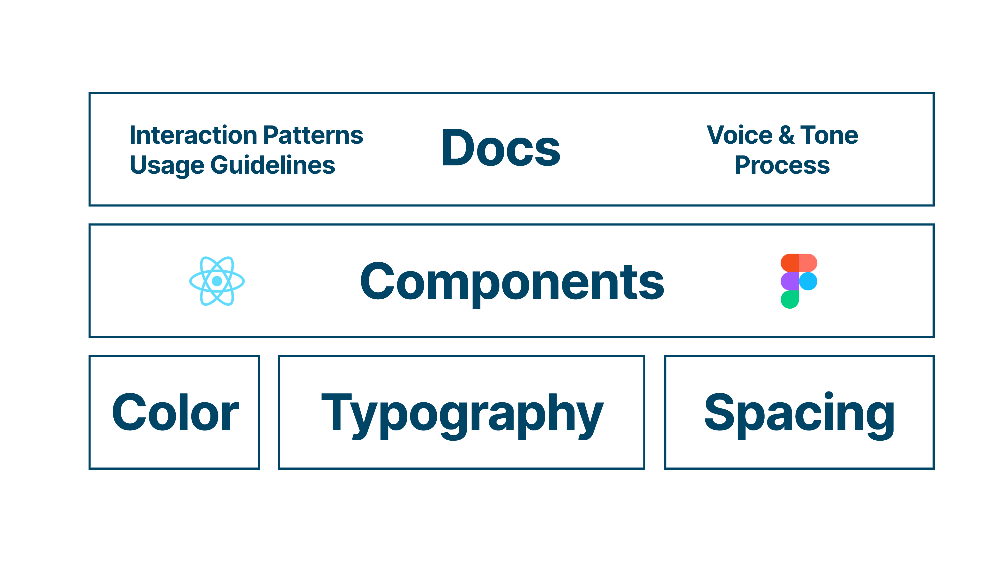
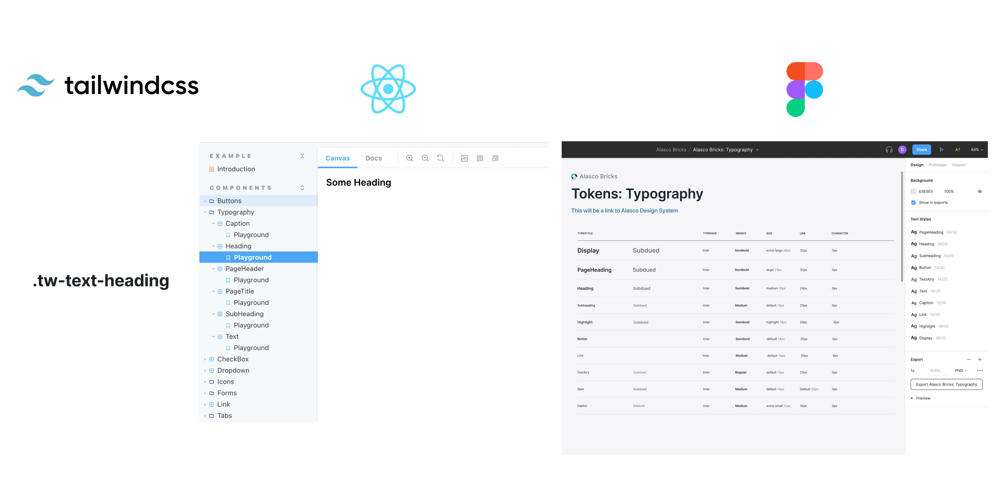
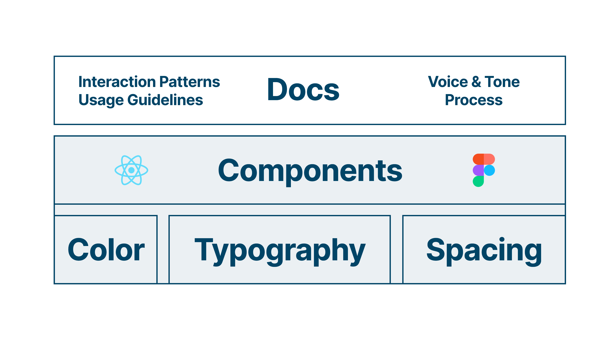

---
authors:
  - frontend-team
date: 2021-10-11
title: How we started the Alasco design system
subtitle: Launching a design system at a fast-growing startup
thumbnail: ./images/design-system.png
teaseralt: Photo of company logos (npm, storybook, react, tailwindcss, figma)
description: Launching a design system at a fast-growing startup
---

In this post, we'd like to share the story of how we redesigned the entire UI of Alasco and launched our design system. For that, let's start in February 2021. At the time, the frontend team was composed of six frontend engineers split between 2 product teams and our designer David, who had joined us a few months prior.

### Goodbye Bootstrap

The first version of Alasco was based on a customized bootstrap theme. This setup served us well in the first year of the company, but as we started to add more custom interfaces and shift from [Django](https://www.djangoproject.com/) views to React, we increasingly started to feel the tension between Bootstrap and the custom experiences we wanted to provide for our users. Inside of our monorepo, we had a folder that housed our shared components, which extended Bootstrap components via [styled-components](https://styled-components.com/).

## A pilot project: Alasco 2.0

Around this time the idea of completely overhauling the user interface of Alasco started to gain traction. This was a perfect opportunity to rethink how we build user interfaces and start a design system. To know where we want to go and why the effort is worth it, it was important to clarify what we want to achieve with our design system.

## The goal: Higher quality user experiences, faster

Ultimately, the design system is useful if it allows us to build **_higher quality, more consistent user experiences, faster._** As part of this, we identified three subgoals.

1. **Establishing a shared language** across engineering, product & design for anything related to our user interfaces, so everyone shares the same understanding and can easily reference UI elements, tokens & patterns.

2. Empowering **engineers, designers & members of the product team to easily prototype & build production UIs** with components that exist both in Figma and React.

3. **Documentation (aka instruction manuals)** that describes **how to use and assemble components** **to build great user experiences**. This spans from UX copy guidelines (e.g. what text to use in a button) to interaction patterns (e.g. how to build intuitive editing experiences).

### Redesigning the whole app

Not only did we set out to establish an intuitive design system, the system also needed to support the redesign of the entire application, planned to release in less than 2 months. A redesign is non-trivial, as you're both figuring out new patterns while dealing with a lot of existing styles, UX patterns, tech debt, and other moving parts. Since quality & resources are non-negotiable, we embraced this constraint and adjusted the scope to help us focus on the most important parts of the system.

### Treat it like a product: Start small

It helps to think about the design system in the same way we approach solving problems for our users. Starting small, learning from users (engineering, design & product), and iterating from there.

In this case, this meant focusing on the first two subgoals: **Establishing a shared language** and providing an initial **set of components in React & Figma**.

Since the team was still relatively small and we could resolve most questions in a quick chat, we deliberately deprioritized elaborate documentation in the first version.

## Towards a shared language

As a first step in creating a shared language, we needed a name for the design system. Something you can point to. After a brainstorming session with the team, we quickly settled on **Bricks.** This is both an homage to the construction industry we're in and to the nature of a design system: providing building blocks (bricks 🧱) that can be assembled to build buildings in the real world or in our case, great user experiences.

### Getting the tokens right

Tokens are the core visual styles that form the basis of every piece of UI. At the core, visual appearance boils down to applying color, typography, and spacing consistently.

**What separates a token from a simple variable?**

Let's take the example of color. A simple color variable could be _gray-80_. That's great. At least we're not using a hex value directly. But when trying to decide what color to use for text on an orange background in a banner, the variable alone doesn't provide an answer.

**A token contains a decision.**

Mapping the token _text-color-on-warning_ to the internal color variable _gray-80_ makes picking the right color easy. Note also that _warning_ is an encoded decision to use the internal variable _orange-20_ for any background that should warn the user about something.

An example from our banner component and it's tokens: "I'm on a warning background, therefore use the token _text-color-on-warning_."

The same rationale applies to spacing. Instead of dealing with pixel values directly, giving spacing tokens meaning (such as "tight", "loose") or limiting the choice to values on a scale referenced by units (e.g. 1 unit = 4px, 2 units = 8px, etc.) helps create consistency by making it easier to talk about the tokens as well as restricting the possible options. If you're curious to learn more, Nathan Curtis has [great](https://medium.com/eightshapes-llc/naming-tokens-in-design-systems-9e86c7444676) [articles](https://medium.com/eightshapes-llc/tokens-in-design-systems-25dd82d58421) on architecting tokens.

## Setting up the design system

Although anything new we write is written in Typescript/React, some existing views of the app are still made up of Django html templates. To restyle those as part of the redesign, we needed a flexible solution that works in non-React contexts to encode our tokens. This eliminated other React-based approaches, like [styled-system](https://styled-system.com/).

CSS to rescue. [Tailwindcss](https://tailwindcss.com/), a popular utility class framework, allowed us to create our design language and encode our decisions in tokens. Those tokens are then made available as css classes, which we can use across the design system package, Django templates, as well as in React components outside of the design system to apply the design decisions.

Here's how the shared language for a **heading** text style looks like across our utility classes, React components, and [text styles in Figma](https://www.figma.com/best-practices/typography-systems-in-figma/).

### A stronger boundary

To achieve a stronger separation between the design system components and feature-specific components than the shared components folder we previously used inside of the main application, we set up a separate repository for the bricks npm package. A CI pipeline and versioning managed automatically via tags allows us to easily deploy new versions via [Github packages](https://github.com/features/packages). This separation makes it impossible to reference anything from the main application and also makes us think deeper about what really should be a part of the design system and what might be better suited as a [one-off component](https://bradfrost.com/blog/post/where-to-put-one-off-components/).

### Starting with the most foundational components

To achieve the quality of components we wanted to provide with the design system - in terms of API, reusability, and UX - we focused on a small subset of the most foundational, composable components: Buttons, Typography, Dropdowns, Links and Tooltips.

With all our tokens exposed as utility classes, we were confident that we can redesign any part of the application in a consistent way, without providing components for all new UI elements to start. This took a lot of pressure off the initial component library. Over time, as proven patterns emerge, we can selectively convert components from the application into reusable design system components.

## Launching the redesign

Within about six weeks, we went from our old bootstrap design riddled with inconsistency, to launching a complete overhaul of our visual design and navigational structure, while also laying the foundation for our design system. Through the use of tokens exposed as css utility classes, we also made it easy for the whole engineering team to contribute, including our more backend-focused engineers.

Let's look back at what we have so far.

1. We've **established a shared language** by setting up consistent tokens

2. We've set up an initial set of **easy to use components in React & Figma to prototype and build production UIs**

This has already been a positive improvement to our workflow. Creating realistic mockups is a matter of composing Figma components and applying tokens. Going from design to pixel perfect UI is a matter of examining the Figma design for components, choosing the matching component from the React library, or applying the corresponding tokens to translate the design into code. The shared language is starting to take hold.

## From 2 to 7+ teams

As we scale to more teams and people using the design system over the next year, we are starting to feel the need to invest in the third aspect of the design system: **documentation.** Documenting interaction patterns, do's and don'ts, and component best practices so all teams can be empowered to easily build consistent experiences.

For us this means: starting small and iteratively. Our first iteration of documentation lives in **[Notion](https://www.notion.so/)**, where we already collaborate on our internal documentation**.** As we learn about the documentation needs and how to write great documentation, we will move this to a fully custom page, that unifies anything related to building user experiences in one place and brings documentation & implementation closer together.

And from thereon, iterate to continuously elevate the experiences we build for our users, while at the same time making it easier, faster, and more enjoyable to do so.
