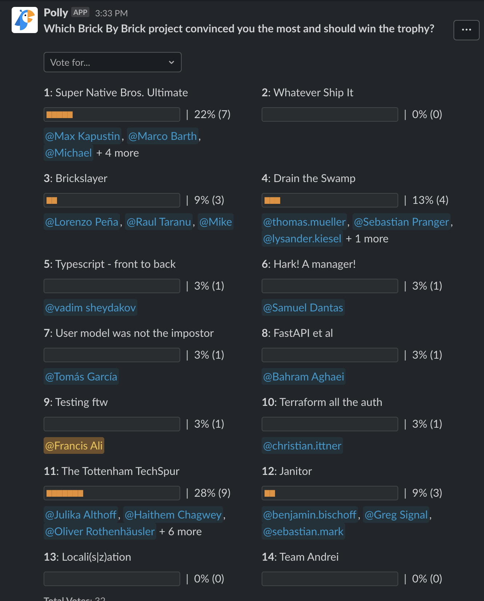

---
authors:
  - francisali
date: 2022-06-29
title: Brick by Brick, Click by Click
subtitle: Hack day at Alasco
thumbnail: ./images/hackathon.jpg
teaseralt: Hackathon - Photo By Alex Kotliarskyi (https://unsplash.com/@frantic)
description: The Birth of Brick by Brick
---

The Birth of Brick by Brick

# Introduction

The 12th of May 2022, a normal day for some but not for the Product and Engineering team who were situated either at home or on the 4th floor. Eyes were fixated on the clock, waiting for it to strike 3pm. You may be asking, what was so special about that time? Why was today not so normal?

24 hours of limitless freedom to create, play and present ideas that may go nowhere - or that might just help Alasco impact the world further. Following the spirit of Hackathons, this year we adapted and evolved the company hack day and birthed into the world **Brick by Brick**.

# Improve & Innovate

Home to 40 engineers from 20 different nationalities, it was time for Alasco to build a hackathon around such a diverse set of people. Brick by Brick brought engineers and designers together from 5 different teams, who often don’t get to work alongside one another, to just go all out with their creativity. The sky truly was the limit.

Every idea was accepted, regardless of how crazy it sounded. On the one hand we had initiatives to reduce areas of tech debt and bring legacy code to a more modern standard. We also had ideas to build mobile apps to allow users to manage their tasks (even while in the bathroom) or bring the Alasco web application over to a different framework such as Remix (because why not).

# Choose your team name

Ah yes, the most important part of any hack day. Choosing a team name. This is the distinguishing moment am I right? Sarcasm aside, this is the part that really adds character to a hackathon. Most teams pretty much competing for the most humorous name that they can think of, and they didn’t disappoint. We had names such as:

- Super Native Bros, Ultimate
- Hark! A manager
- Bricklayers
- Whatever Ship It

# Talk, Code and Eat

It’s important to keep in mind that hackathons aren’t defined by how much code one can write within a set period. It is, after all, a social event. A good time to mingle with other engineers whilst working on something that you normally wouldn’t during working hours.

There is only one scientific way to bring large groups of people together, and that is pizza. 40 in total were ordered and delivered to the office, along with an undefined number of Club Mates and beers. We would spend some of our time around the pizza table grabbing slices whilst catching up and discussing what project we were working on.

# Pitch and Vote

As the 24 hours drew to a close, it was time to ready up our projects and prepare to pitch. The entire company was invited to a virtual meeting where each team would take 5 minutes to present or demonstrate what they worked on or discovered. Packed with dry engineering jokes, fantastic project outcomes and useful insights, it was a great way to let the rest of the company know what we had been doing for the past day.

Once the final presentation had concluded, a voting session was created on the general slack channel where the whole company could participate in choosing the winner of the hackathon.

# Drum roll please…

The voting session lasted for 2 working days. And as you may notice from the results above it was a tight race between the two teams **Super Native Bros, Ultimate** and **The Tottenham TechSpur**. However the Tottenham TechSpur won by just 6% more votes.

The project developed by that team was to solve the issue around deleting trial accounts that we give to potential customers. As of right now, the deletion of said accounts is a rather tedious process which can only be done by an engineer.

What was developed in the end was a Notion integration with the Alasco app which allows our Account Executives to mark which trial accounts they want deleting with a worker on our server taking care of the cleaning up process.

# We’re all winners

The most important value of the Brick by Brick hackathon is that it supports a culture of innovation and to foster an environment where we’re all comfortable to socialise in. We believe in this work, even if it never ships, and love to share the creativity and thought put into these ideas.

If after reading, you are saying to yourself that you want to work in such a workplace and to partake in events such as these. Then do not hesitate to reach out and apply to the open positions we have.
