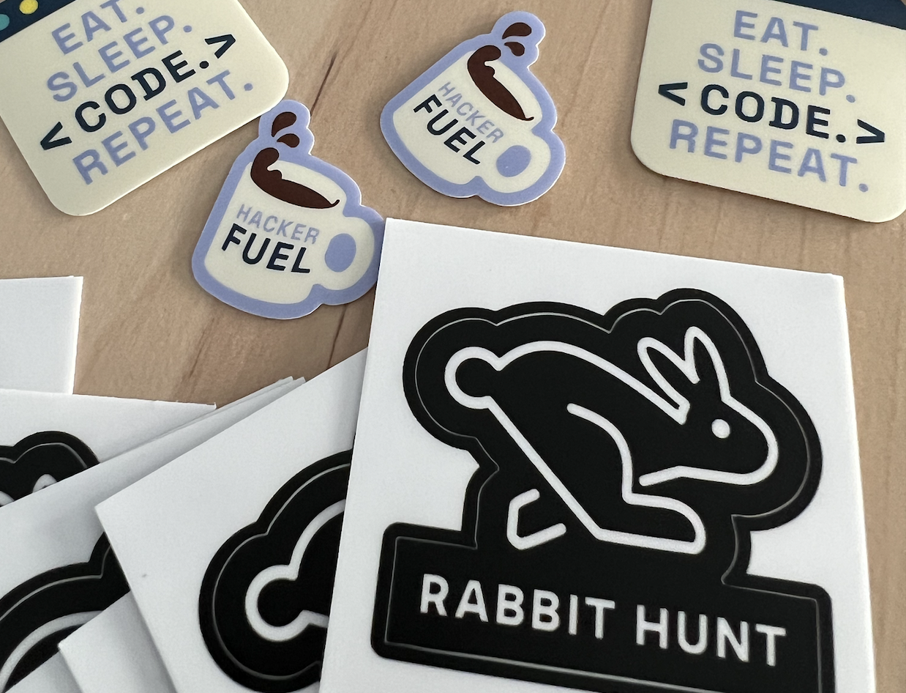

---
authors:
  - UlianaMunich
date: 2023-07-11
title: Product and Engineering Hackathon Rabbit Hunt
subtitle: An internal hackathon, a blog post, and a way of making innovation with fun.
thumbnail: ./images/digital-banner.jpg
tag: featured
description: Internal hackathons and innovation
---

## Innovation and what does it have to do with Hackathon?

Innovation is a key driver for business growth and success in today's fast-paced world. And let’s be honest, for us engineers, it is fun to actually code and experiment with state-of-the-art technologies. o encourage this within our organisation, we at Alasco recently held our very own second edition of product and engineering Hackathon 2023, the rabbit hunt edition.

This time it was made not only by engineers for engineers but with the joint effort of product managers and designers where we experienced going from the discovery to the delivery phase in just 8 hours. If you are curious about the result, let’s dive in.

## The prep

With four volunteers from Product and Engineering Departments we worked together to find new ways to encourage people from both departments to get involved in collaboration and learnings from colleagues you haven’t worked with before. At the same time, we used this as a chance to integrate new joiners into already established teams via collaboration.

Since our last hackathon back in May 2022 [“Brick by Brick”](https://alasco.tech/2022/06/29/brick-by-brick-2022.html) we wanted to bring this year’s edition a unique memorable vibe. But how is the “”rabbit related to Tech, you might ask? Well, every discovery phase often challenges your beliefs and changes your perception. Sounds familiar if you relate to Alice in Wonderland who followed the white rabbit. With all of it in mind,

### So how did we frame our rabbit hunt?

The event was held over one day. Kicking it off at 9:00 am was risky, but it was definitely worth it! And closing the day by presenting the results to the entire company at 5 pm. With participants working both on-site and remotely we delivered **14 projects with 34 active participants**. Unbelievable, isn’t it?

The hackathon was structured around a problem-to-solution approach, with teams identifying key business challenges and **developing innovative solutions around our SaaS software, internal processes automation such as incident handling, 3D building modelling, and high-performance chart rendering of sustainability measurements**.

### Was a white rabbit found?

Let’s use a quote from one of our teams to answer: “Heck, yes!”

Just 2 weeks after the hackathon took place we released a fully production-ready feature designed and developed by a team of two people: designer Sophia Scholpp and engineer Dima Pravotorov. More to come: 3 projects are currently in the pipeline to make production ready and 2 are in a backlog.

Here are just some of the impressions from participants:

> **_Just constant happy mood >>>>> one memorable moment._**

> We should do Hackathons twice a year or even include 1 Sprint per Quarter where Engineers are in the lead of driving Hackathon-like projects to foster engagement and enthusiasm, engineering-driven discoveries, and domain knowledge across the Engineering department.

> **_An amazing atmosphere with awesome people. No meetings, just pure focus, in the flow and freedom to develop what I always wanted to. It was also great to have product and designers in the team!_**

> Incredibly high-quality ideas (really impressed), super atmosphere, great organization & a lot of fun

All participants liked the full-day hackathon and the average satisfaction ratio was 4.8, where 5 is the max. 50% of which showed a high interest to repeat it this year already without waiting for the next one. What a spirit!

## What's next?

There is way more going on during the hackathon and after. The aftertaste is still flying in the air even after four weeks. But without any further details, we encourage you to join our team and experience it live with us next time. It will be a new edition and a different format, but what we definitely can promise is a fun, open-minded atmosphere, and a club mate ;)

We believe that events like this are critical for driving innovation and growth, and we are committed to making them a regular part of our company culture.

If you're interested in learning more about our hackathons or want to get involved in future events, please don't hesitate to reach out to us. We're always looking for new ideas and talented individuals to join our team and help us continue to innovate and grow.

### #tech #innovation #hackathon
