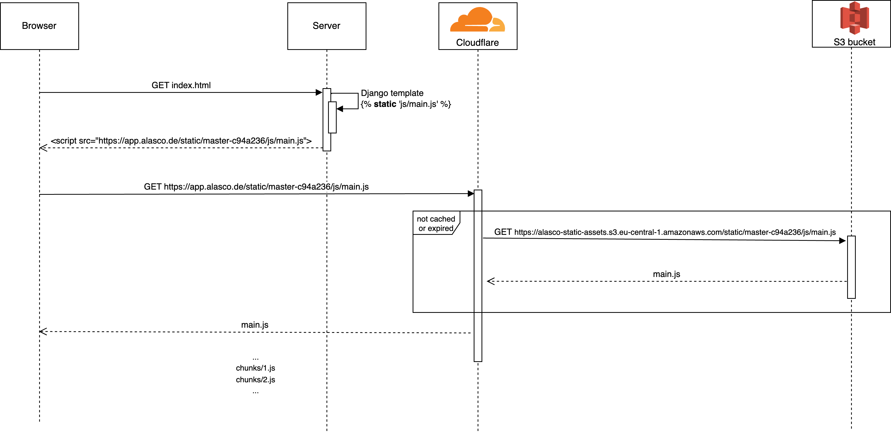

---
authors:
  - chagweyh
date: 2023-08-31
title: How we serve static assets at Alasco
subtitle: How static assets are served in a Django React hybrid application.
thumbnail: ./images/minified-js-file.jpg
description: How static assets are served in a Django React hybrid application.
---

At Alasco, we are constantly striving to improve our front-end architecure. As our application has evolved, our architecture has also changed to incorporate new technologies and features. In this article, we will focus on how we build, deploy, and serve our static assets.

## A bit of background

Alasco started as a fully server-side rendered Django application. As time passed, we needed to build increasingly complex UI interactions. That's when we realized that we needed something more powerful that would allow us to write code in a maintainable and scalable way. We ended up settling on React.

Today, the application's frontend is a hybrid of a single-page app and a server-side rendered app. The majority of each page is rendered by the backend, but there are special mount points for mounting React-based features. These features are loaded dynamically when the page is first rendered, and they can make requests to APIs or render whatever content is needed.

_Page which is served by the Django backend:_

```html
<!doctype html>
<html lang="en">
  <head>
    <link
      rel="stylesheet"
      type="text/css"
      href=""
    />
  </head>
  <body>
    <h1>Hello, I'm static and from Django</h1>

    <div data-react="mount-point" />

    <script src=""></script>
  </body>
</html>
```

_Frontend part to mount React components:_

```tsx
import React from "react";
import ReactDOM from "react-dom";

import { registerFeature } from "@alasco/features";
import { findMountPoint } from "@alasco/support/dom";
import { LazyLoaded } from "@alasco/support/react";

const ReactComponent = React.lazy(() => import("."));

function mountFeature() {
  const reactFeature = findMountPoint("mount-point");

  if (reactFeature) {
    ReactDOM.render(
      <LazyLoaded>
        <ReactComponent />
      </LazyLoaded>,
      reactFeature,
    );
  }
}

registerFeature(mountFeature);
```

Additionally, we take advantage of [code splitting](https://developer.mozilla.org/en-US/docs/Glossary/Code_splitting) by lazy loading these features. This helps us to reduce the amount of JavaScript that needs to be loaded on each page, which contributes to a faster page load time and improved user experience for our users.

## How the assets are built

We use [Webpack](https://webpack.js.org/) to help us build our frontend application. After the assets are built, we move them to the static folder of the Django application, where they are served to the client:

```html
<link
  rel="stylesheet"
  type="text/css"
  href=""
/>

<script src=""></script>
```

On production, we have a Github Action job that does the same thing; it gets triggered automatically on each commit that we push.

## How the assets are deployed

Previously, the assets were served from the filesystem, but that was not optimal because it increased the load on our webservers and made it hard to cache them.

Nowadays, we upload the assets to an S3 bucket under a unique version. This ensures that they will be cached by the browser. The unique version that we use is a combination of the branch name and the last commit hash. In practice, we would have something like this: `https://alasco-static-assets.s3.eu-central-1.amazonaws.com/static/master-c94a236/js/main.js`


## How the assets are served

We use Cloudflare as a CDN to serve the static assets. It sits as a layer on top of the S3 bucket. This optimizes performance by making sure that they are delivered from nearby servers, which reduces the loading time.

The diagram below gives an overview of what happens when a static asset request comes:



## Conclusion

I hope this article gave you a good idea about how we serve static assets at Alasco. As we mentioned in the beginning, architecture is an evolving thing, and we are always looking for opportunities to improve it.
