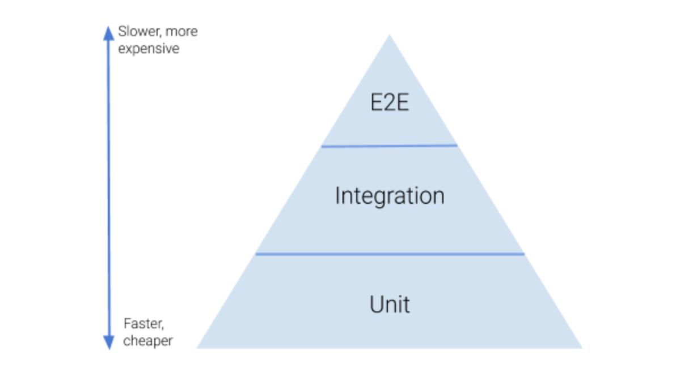
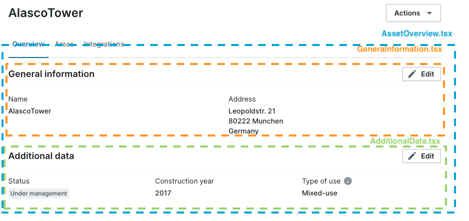
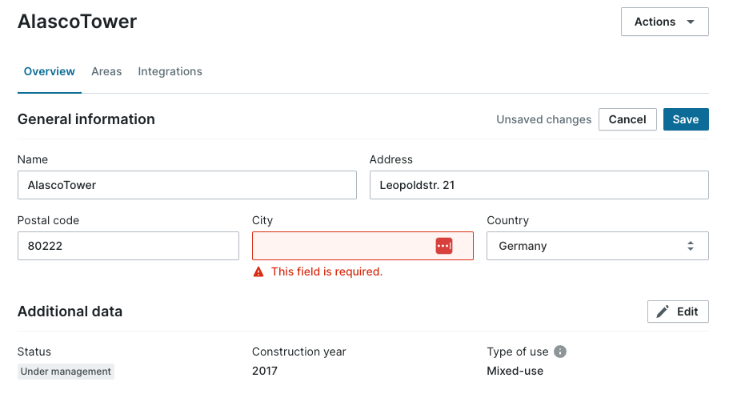
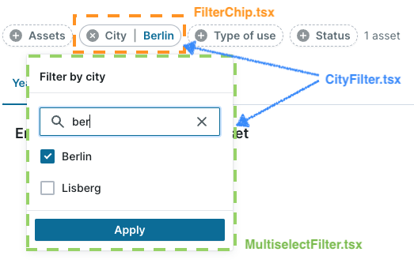
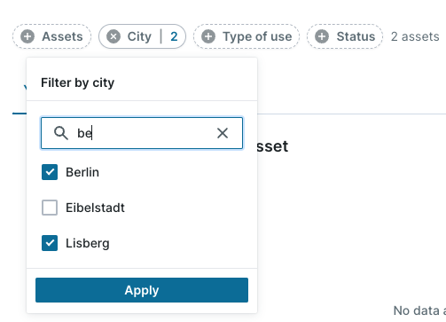

---
authors:
  - ewanestorowicz
date: 2023-09-13
title: React Testing Guidance
subtitle: Our frontend testing journey at Alasco
tag: featured
thumbnail: ./images/react-tests.jpg
thumbnailSrc: https://unsplash.com/de/fotos/EWLHA4T-mso
description: React; Frontend; Testing;
---

This article summarises what should be tested and how to write frontend tests. It also provides some best practices and examples that will hopefully help you write better tests.

If you don’t have much experience in writing frontend tests, don’t worry! I was trying to cover all the problematic parts and answer questions which I have been asking myself once I started writing tests using **React Testing Library**.

Before reading this document, it's recommended that you become familiar with the **main concepts** of _Testing Library_. You can find more information about it [here](https://testing-library.com/docs/) and [here](https://testing-library.com/docs/react-testing-library/example-intro).

We aim to follow best practices and avoid common mistakes when using _React Testing Library_. In [this great article](https://kentcdodds.com/blog/common-mistakes-with-react-testing-library), you can find helpful guidance and learn more about these common mistakes.

🤓 [Here](https://testing-library.com/docs/react-testing-library/cheatsheet/) you can find a cheatsheet which is a short guide to all the exported functions in _React Testing Library_.

## What should I test and how to write tests?

### Test pyramid

I am pretty sure you have already heard about the test pyramid many times before. It looks like this:

<a class="image-source-link text-xs mb-8" target="_blank" href="https://www.innoq.com/en/blog/tests-granularity/">Image source</a>


🏎️ The basic idea is that most of the tests in the application should be isolated **unit tests**. These tests are typically less complex and focus on testing small, specific parts of the software

🚀 The next level in the pyramid are **integration** tests. You need them to test the integration between different modules and components to make sure that they are working together as you expect them to.

🐢💸 The last part are **end-to-end (E2E)** tests which are very expensive, because they treat the system as the whole and interact with it as the actual users. It’s not only time consuming to write them but also to **maintain**.

---

❗️The test pyramid is an important concept to keep in mind, but it should be viewed as a **guideline** rather than a **strict rule** that must be blindly followed.

That's a nice theory, but how does it apply to our frontend tests? 🤔

## React Tests - case study

Before we start analysing a concrete example, let’s stop here for a while and think: what makes a test a **good** test?

### What are good tests?

First of all, frontend tests are totally different from backend tests. Why is that?

> The more your tests resemble the way your software is used, the more confidence they can give you.

-- [Guiding principles from React Testing Library](https://testing-library.com/docs/guiding-principles)

[React Testing Library](https://testing-library.com/docs/) (which we use) encourages us to write all the tests from the user's perspective. In other words, we try to test what the user sees and how they interact with our system. It means that the test pyramid **does not apply** to our concept as much. If we should write tests from the user perspective, it means that we should have **mostly integration** and **e2e** tests and very **few unit** tests 🧐. Integration tests are covered using _React Testing Library_.

### Concrete example

Knowing all that, you have to ask yourself a question: what exactly do you want to test and how.

I will explain how do I think about writing tests and what I would test and where. 


**TLDR;**

- 👤 Try to write your tests the way the users would interact with the **components** (UI elements).
- 💸 Think about the **cost** of writing a test, and think about where to test what.
- 👀 To test common user journeys, it's better to **zoom out** and write larger integration tests that test not only success scenarios but also error handling.
- 🔍 To test many edge cases, it's better to **zoom in** and write many smaller tests (e.g. checking the interaction between two components or form validation).

---

✨ Let's take a look at the first example! ✨

**Zoom out: integration tests 👀**

First, we will analyse what we can see in the screenshots below and try to think of test cases.





Here we see a large page container `AssetOverview` containing `GeneralInformation` and `AdditionalData` (both with read and edit mode).

For this type of test (testing a lot of components working together) I would write some longer tests, without testing any validation.

So what would I be testing here? Here some examples:
1. *User navigates to the page and sees first a loading spinner and later both sections being rendered.*
2. *The user can edit the first section, save the changes and see a green toast message.*
3. *User can edit the second section, save the changes and see a green toast message.*
4. *Error handling:* 
    1. *User navigates to the page and BE returns a 400 or 500 -> let's assume that the error handling is working properly.*
    2. *Saving changes (section 1 and section 2) and BE returns a 400 or 500 -> let's assume that the error handling works properly.*

**Zoom in: Smaller integration tests 🔍**

Let's quickly summarise what we can see here. We have a component called _CityFilter.tsx_, which is a container for both _FilterChip_ and _MultiselectFilter_.
Looking at the two screenshots, what test cases might we need here?





Here I'm testing the integration, but not with as many different components as in the previous example. This helps me to still have good integration tests and also to test many different use cases.
So what would I be testing here? Here some examples:

1. *User selects only one filter and apply (chip button will behave differently -> showing a text)*
2. *User selects more than one filter and apply (chip button will behave differently -> showing a number)*
3. *User selects a filter, does not apply it and clicks outside to close the list and opens a list again afterwards (no filters should be applied or persisted)*
4. *Testing search:*
  1. *User types text in the search field (we want to find some results), selects a first result from top & applies it, opens a list again (to make sure that the selected filter is selected and the search field remains empty and does not contain the old value)*
  2. *User types text and there are no results for a given query*

This filter could, of course, be used at the top of a page and show some search results below. Major integration tests (including testing the whole page) would be something like:
1. *User selects a filter and there should be some search results* -> let's assert what will be rendered as a search result below
2. *User selects a filter, but there are no search results*
3. *User selects a filter, but the backend returns a 400 or 500* -> let's assert that the error handling works properly

**Utils**

How about testing some helper methods from `utils.ts`? I always test them because the tests are cheap and can be reused in many components. This ensures that components are using reliable and tested code.

These are simple unit tests that don't require the use of the _React Testing Library_, as no components are being tested. Using just _jest_, writing these tests is really fast. I always recommend moving some of a complex component's methods into `utils` and covering them with test cases. This way, you can also test all edge cases, if there are any.

## How can I write better tests?

If you write many integration tests, you have probably already noticed that those tests are not only pretty long but also have some shared functions / selectors.

Here are some patterns I’m always trying to apply to make my tests readable and understandable for other engineers.

### Define shared selectors in e.g. setup() method

👉 **DRY: Don’t repeat yourself!**

```tsx
const setup = () => {
  renderWithProviders(
    <div>
      Some text
      <CityFilter />
    </div>,
  );

  const chipButton = screen.getByRole("button", {
    name: /am.multiselect_filter.filter_name.city/,
  });

  // ✅ create selectors and reuse them in your tests
  return {
    getFilterChipButton: () => chipButton,
    getPlusIcon: () => within(chipButton).getByTestId("plus-icon"),
    getApplyButton: () =>
      screen.getByRole("button", { name: "am.multiselect_filter.button" }),
    getFilterHeader: () =>
      screen.queryByText(/am.multiselect_filter.header_name.city/),
    getEmptyText: () => screen.getByText(/am.multiselect_filter.no_data.text/),
  };
};
```

✨ Let's bring it into action! ✨

```tsx
it("should close dropdown if user clicks outside and do not apply any filters", async () => {
  // ✅ reusing selectors defined in the setup methods
  const { getFilterChipButton, getFilterHeader, getPlusIcon } = setup();

  // open filters
  await userEvent.click(getFilterChipButton());

  await userEvent.click(screen.getByText(/München/));

  // assert that icon has not rotated
  expect(getPlusIcon()).toHaveClass("tw-rotate-0");

  // click outside
  await userEvent.click(screen.getByText(/Some text/));

  expect(mockedContext.setCityFilterOptions).not.toHaveBeenCalled();
  // assert that icon has not changed
  expect(getPlusIcon()).toHaveClass("tw-rotate-0");
  // assert that dropdown has been closed
  expect(getFilterHeader()).not.toBeInTheDocument();
});
```

Using this `expect(getPlusIcon()).toHaveClass("tw-rotate-45");` is much easier and more readable than using this:

```ts
expect(
  within(
    screen.getByRole("button", {
      name: /am.multiselect_filter.filter_name.city/,
    }),
  ).getByTestId("plus-icon"),
).toHaveClass("tw-rotate-45");
```

> 💡 It’s easier to define very long selectors **once**, give them a proper name and reuse them in all tests than defining it every time.

### Extract helper methods

Helper methods help to understand what the user is doing (especially if you are filling out veeeery looong forms).

Let's compare these two code snippets:

```ts
it("should edit a gas measure and save changes", async () => {
  setup();

  // ✅ using helper methods to make the tests more readable and easier to maintain
  await fillForm();

  const saveButton = screen.getByRole("button", { name: /save_button/ });
  await userEvent.click(saveButton);

  // your assertions...
});
```

vs.

```ts
it("should edit a gas measure and save changes", async () => {
  setup();

  // 😱 this is how it looks like if we inline the method
  // you will have probably not only one test where you want to fill out the form...
  const editButton = screen.getByRole("button", { name: /edit_button/ });
  await userEvent.click(editButton);

  const heatingSystemEfficiencyFactorField = screen.getByRole("textbox", {
    name: /heating_system_efficiency_factor.label/,
  });
  const heatingPowerField = screen.getByRole("textbox", {
    name: /heating_power.label/,
  });
  const heatingPowerCostFactorField = screen.getByRole("textbox", {
    name: /heating_power_cost_factor.label/,
  });

  await userEvent.clear(heatingSystemEfficiencyFactorField);
  await userEvent.type(heatingSystemEfficiencyFactorField, "123");

  await userEvent.clear(heatingPowerField);
  await userEvent.type(heatingPowerField, "456");

  await userEvent.clear(heatingPowerCostFactorField);
  await userEvent.type(heatingPowerCostFactorField, "789");

  const saveButton = screen.getByRole("button", { name: /save_button/ });
  await userEvent.click(saveButton);

  // your assertions...
});
```

> 💡 Introducing helper methods will not only improve the **readability** of your test, but will also make the **maintenance** easier and less painful.

### Add comments if you think they might be helpful

I’m not a big fan of writing comments (very often commented code changes but the comments not 😅). However, in some long and complex tests, comments can be very helpful:

```ts
it("should find some results for the given search query, select the first one and apply", async () => {
  const query = "res";

  const { getFilterChipButton, getApplyButton, getSearchInput } = setup();

  await userEvent.click(getFilterChipButton());

  await userEvent.type(getSearchInput(), query);

  // ✅ small comments might be helpful here
  // show loading spinner once search is triggered
  expect(screen.getByTestId("loading-spinner")).toBeInTheDocument();

  // do not trigger the search immediately (debouncing)
  act(() => {
    jest.advanceTimersByTime(500);
  });

  // hide loading spinner once there are search results
  expect(screen.queryByTestId("loading-spinner")).not.toBeInTheDocument();

  // should find only two results which contain searched query
  expect(screen.getAllByRole("checkbox").length).toBe(2);
});
```

or

```ts
// ✅ making it explicit where the values come from in all the assertions below

// assert that fields are filled-out properly
// values come from BuildingEnvelopeConfigFixture
expect(getFloors()).toHaveValue("5");
expect(await getRoomHeight().currentValue()).toEqual(
  "am.renovation_measures.fields.room_height.options.very_high",
);
expect(await getAdjacentBuildings().currentValue()).toEqual(
  "am.renovation_measures.fields.adjacent_buildings.options.two",
);

// ✅ explaining why a field has changed its state if it might be confusing
// (so that we don't have to check implementation details)

// dormers field is disabled because there is no roof (flat)
expect(await getDormer().disabled()).toBe(true);
```

> 💡 Use the comments if you think they might be **helpful** and do not get outdated.

### Mocks assertions: please be as specific as possible

If you use some mocks and write assertions for them, please don’t forget to check:

- ✅ how many **times** a mocked function has been called (very important for all service mocks) → use `toHaveBeenCalledTimes(...)`
- ✅ check the **args** → use `toHaveBeenCalledWith(…)`
- ✨Use `expect.objectContaining` with **caution**:
  - Use it if you only want to check a **subset** of the argument that is relevant to the case being tested (this can help improve the test durability, for instance).
  - Sometimes it may be **overused**, and important assertions may not be tested.

> 💡 `toHaveBeenCalled()` → is not very specific so please use both methods mentioned above ☝️

### Don’t copy component’s logic into your test

Does it make sense to copy-paste the logic and write tests like this? 🤔

```tsx
// in the component:
<Table.Cell>{truncate(description || "", { length: 60 }) || "--"}</Table.Cell>;

// 😱 in your test:
expect(description).toHaveTextContent(
  truncate(field.description || "", { length: 60 }) || "--",
);
```

👉 Test should help us to **catch** bugs and doing copy-paste like this we won't be aware of any bugs or problems, because we're reusing the logic and not actually testing what it does!

👉 Writing good tests is sometimes different from writing good production code. For example, having hard-coded strings is often a good thing (as it makes it easier to see what's expected):
```ts 
expect(emissionFactorInput.value).toEqual("0.4321");
```

## Summary
As you may have noticed, a good testing strategy is a very large and complex topic. It also took me a while to see and then implement some of the patterns I have shared with you.

Having such a testing guidance in your project will make code reviews much faster and easier (you can link to a section from the testing guidance you have agreed as a team and request changes 🤓).
Using some shared selectors and helper methods will not only make your tests more readable and shorter, but any refactoring will be much faster and less painful, because you would only have to change the selector method once.
