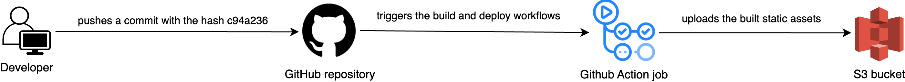
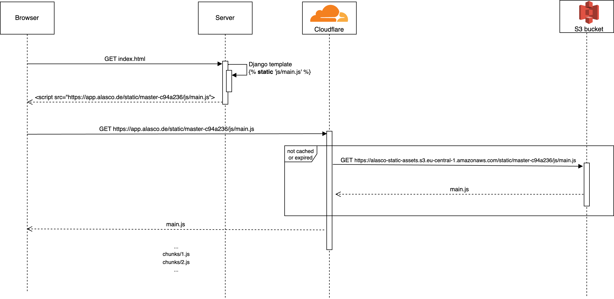

---
authors:
  - chagweyh
date: 2023-10-23
title: How we serve static assets at Alasco
subtitle: How static assets are served in a Django React hybrid application.
thumbnail: ./images/minified-js-file.jpg
description: How static assets are served in a Django React hybrid application.
---

At Alasco, we are constantly striving to improve our front-end architecture. As our application has evolved, our architecture has also changed to incorporate new technologies and features. One of the projects that we worked on recently, was to optimize the way we serve our static assets. In this article, we will talk about why, and how we did it.

## A bit of history

Alasco started as a fully server-side rendered Django application. As time passed, we needed to build increasingly complex UI interactions. That's when we realized that we needed something more powerful that would allow us to write code in a maintainable and scalable way. We ended up settling on React.

Today, the application's frontend is a hybrid of a single-page app and a server-side rendered app. The majority of each page is rendered by the backend, but there are special mount points for mounting React-based features. These features are loaded dynamically when the page is first rendered, and they can make requests to APIs or render whatever content is needed.

_Page which is served by the Django backend:_

```html
<!doctype html>
<html lang="en">
  <head>
    <link rel="stylesheet" type="text/css" href="" />
  </head>
  <body>
    <h1>Hello, I'm static and from Django</h1>

    <div data-react="mount-point" />

    <script src=""></script>
  </body>
</html>
```

_Frontend part to mount React components:_

```tsx
import React from "react";
import ReactDOM from "react-dom";

import { registerFeature } from "@alasco/features";
import { findMountPoint } from "@alasco/support/dom";
import { LazyLoaded } from "@alasco/support/react";

const ReactComponent = React.lazy(() => import("."));

function mountFeature() {
  const reactFeature = findMountPoint("mount-point");

  if (reactFeature) {
    ReactDOM.render(
      <LazyLoaded>
        <ReactComponent />
      </LazyLoaded>,
      reactFeature
    );
  }
}

registerFeature(mountFeature);
```

### How the assets are built

We use [Webpack](https://webpack.js.org/) to help us build our frontend application. After the assets are built, we move them to the static folder of the Django application, where they are served to the client:

```html
<link rel="stylesheet" type="text/css" href="" />

<script src=""></script>
```

On production, we have a Github Action job that does the same thing; it gets triggered automatically on each commit that we push.

## What's the problem?

The problem is that this way of serving static assets is not efficient. We generate one single and large bundle file that's not versioned, which means it will not be cached by the browser. So our users would to have to re-download it on each page visit.

Theortically, this could be solved by [code splitting](https://developer.mozilla.org/en-US/docs/Glossary/Code_splitting), but we didn't have the right infrastructure to support that. We use a [rolling deployment strategy](https://docs.aws.amazon.com/whitepapers/latest/overview-deployment-options/rolling-deployments.html) which can lead to chunks collision because our static assets were served from the filesystem, which is also not optimal because it increased the load on our webservers and made it hard to cache them.

## How we tried to solve it

### Deploying the assets differently

One of the main changes that we did, was to upload the assets to an S3 bucket under a unique version rather that keeping them in the app's filesystem. This ensures that they will be cached by the browser. The unique version that we chose is a combination of the branch name and the last commit hash. In practice, we would have something like this: `https://alasco-static-assets.s3.eu-central-1.amazonaws.com/static/master-c94a236/js/main.js`



### Serving the assets differently

We started to use Cloudflare as a CDN to serve the static assets. It sits as a layer on top of the S3 bucket. This optimizes performance by making sure that they are delivered from nearby servers, which reduces the loading time.

The diagram below gives an overview of what happens when a static asset request comes:



### Enabling Code splitting

After building the right infrastructure, we took advantage of code splitting by lazy loading these features. This helped us to reduce the amount of JavaScript that needs to be loaded on each page, which contributed to a faster page load time and improved user experience for our users.

```diff
import React from "react";
import ReactDOM from "react-dom";

import { registerFeature } from "@alasco/features";
import { findMountPoint } from "@alasco/support/dom";
// A custom component that wraps the <Suspense /> and <ErrorBoundary /> react components.
+import { LazyLoaded } from "@alasco/support/react";

-import ReactComponent from ".";
+const ReactComponent = React.lazy(() => import("."));

 function mountFeature() {
   const reactFeature = findMountPoint("mount-point");

   if (reactFeature) {
-    ReactDOM.render(<ReactComponent />, reactFeature);
+    ReactDOM.render(
+      <LazyLoaded>
+        <ReactComponent />
+      </LazyLoaded>,
+      reactFeature
+    );

registerFeature(mountFeature);
```

## Conclusion

By implementing these changes, we observed a decrease of approximately 60% in the number of times a static asset is downloaded. Additionally, our main bundle size reduced by about 18%, and the DOM content loading time decreased by a median of 24-28%.

Throughout the journey, we faced a lot of interesting challenges that were related to cookies and CORS in the context of iframes that deserve their own blog post to talk about.

I hope this article gave you a good idea about how we serve our static assets. As we mentioned in the beginning, architecture is an evolving thing, and we are always looking for opportunities to improve it.
